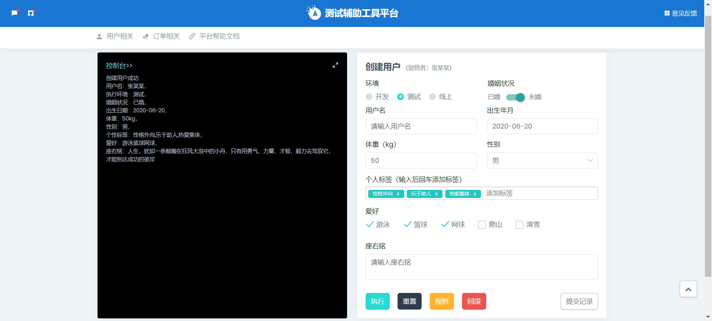
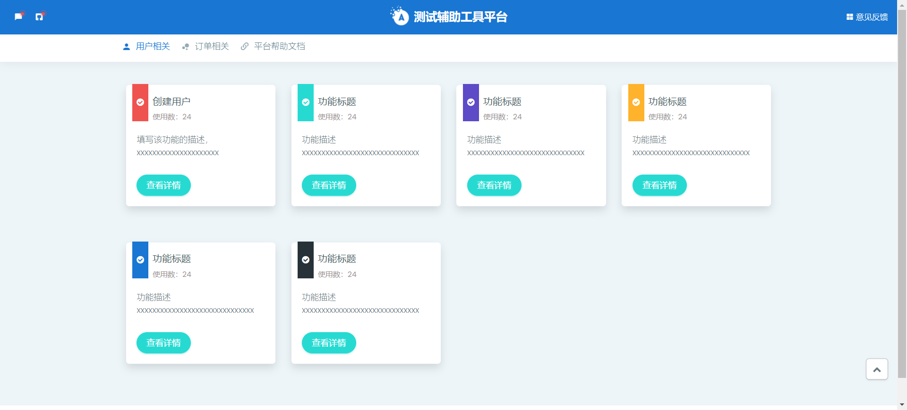

# TestDataFactory
## 一、平台架构介绍
使用Django（后端）+bootstrap（前端）+Mysql开发

### 1、Django介绍（python开发框架）

官方文档：https://docs.djangoproject.com/zh-hans/2.0/
Django 是用 Python 开发的一个免费开源的 Web 框架，是一个遵循 MVC 设计模式的框架，和Spring（Java开发框架）类似。

优点：自带大量常用工具和框架（比如分页，auth，权限管理), 适合快速开发企业级网站；很多类和方法都封装了，直接使用比较简单

缺点：前后端未分离，比较考验前后端的技能，目前主流都是前后端分离（django restframework  、springboot）

### 2、Bootstrap（前端开发框架）
官方文档：https://v3.bootcss.com/

Bootstrap是基于HTML、CSS、JavaScript 开发的简洁、直观、强悍的前端开发框架；而Vue是一套用于构建用户界面的渐进式JavaScript框架，轻量级框架、简单易学、双向数据绑定、组件化、数据和结构的分离、虚拟DOM、运行速度快，VUE目前最流行的前端框架。

## 二、项目介绍
### 1、开发环境搭建
#### 1）配置python环境
python建议安装3.8以上版本，并执行以下命令安装依赖包

    pip3 install -r requirements.txt

#### 2）安装配置mysql
若项目需要在本地开发调试和部署至服务器，当前环境都需安装mysql并启动mysql服务，并创建对应的数据库

配置好mysql后，修改TestDataFactory/setting.py的DATABASES数据库信息，如下

    # 数据库连接信息
    DATABASES = {
        'default': {
            'ENGINE': 'django.db.backends.mysql',
            'NAME': 'TestDataFactory',   # 数据库库名（需提前创建好数据库）
            'USER': 'xxx',            # 用户名
            'PASSWORD': 'xxx',        # 密码
            'HOST': 'localhost',      # 主机ip
            'PORT': '3306',           # 端口
        }
    }

### 2、项目结构

## 三、开发示例演示
这里以`创建用户`为功能例子，完成整个流程的开发，这里已经建好了apps/user目录，用户相关的功能都归类到此目录下

#### 1、构思功能方案
对于本平台来说，前后端只是起到承载的作用，核心还是创建用户本身，它应该去执行具体公司项目业务，
如业务的数据库具体哪些表会插入什么数据/会调用业务项目哪些接口，这才是关键；在这里具体的业务操作不做详细概述。

#### 2、创建模型（数据库相关）
我们需要将使用者的提交记录都存到数据库表里以便追溯和统计，这里会在页面展示`使用数`
##### 1）编写代码
在./apps/user/models.py下编写代码（类似于数据库语句），按照自己的需求来编排字段

    class CreateUserTable(models.Model):
        """
        创建用户
        """
        id = models.AutoField(primary_key=True, verbose_name='主键id')
        user_name = models.CharField(max_length=20, null=True, verbose_name='用户名')
        is_marital = models.BooleanField(null=True, verbose_name='是否结婚')
        environment = models.CharField(max_length=10, verbose_name='环境')
        birthdate = models.CharField(max_length=30, null=True, verbose_name='出生日期')
        weight = models.IntegerField(null=True, verbose_name='体重')
        SEX_CHOICES = [
            ('1', '男'),
            ('2', '女')
        ]
        sex = models.CharField(choices=SEX_CHOICES, max_length=10, verbose_name='性别')
        personality_label = models.CharField(max_length=100, null=True, verbose_name='个性标签')
        interest = models.CharField(max_length=100, null=True, verbose_name='爱好')
        motto = models.TextField(null=True, verbose_name='座右铭')
        create_time = models.DateTimeField(auto_now=True, verbose_name='创建时间')
        update_time = models.DateTimeField(auto_now=True, verbose_name='更新时间')
        create_by = models.CharField(max_length=10, null=True, default='sys', verbose_name='创建人')
    
        class Meta:
            db_table = 'create_user'

##### 2）创建表
在命令行执行以下命令后，`TestDataFactory`数据库中会创建`create_user`表

    python manage.py makemigrations
    python manage.py migrate

#### 2、创建表单字段及数据校验
本功能使用form表单提交数据，则需要规范提交所需的字段，也可以加入参数规则对数据进行合法校验
（如字段长度、数据类型、数据的匹配等），当输入不合法的数据，会对使用者进行提示。./apps/user/form.py编写代码

    class createUserForm(forms.Form):
        """
        创建用户
        """
        user_name = forms.CharField(max_length=20, min_length=1, required=True, error_messages={
            'max_length': '用户名最大长度为10',
            'min_length': '用户名最小长度为1',
            'required': '用户名必填',
        })
        environment = forms.CharField(required=True)
        is_marital = forms.BooleanField(required=True)
        birthdate = forms.CharField(required=True)
        sex = forms.IntegerField(required=True)
        weight = forms.IntegerField(required=True)
        personality_label = forms.CharField(max_length=100, required=False, error_messages={
            'max_length': '个性标签为100',
        })
        interest1 = forms.CharField(required=False)
        interest2 = forms.CharField(required=False)
        interest3 = forms.CharField(required=False)
        interest4 = forms.CharField(required=False)
        interest5 = forms.CharField(required=False)
        motto = forms.CharField(max_length=1000, required=False, error_messages={
            'max_length': '座右铭最大长度为1000',
        })

#### 3、编写核心功能脚本
在./utils/script/下新建`create_user_constructor.py`并新增代码

    from utils.public.log import Log
    
    class CreateUser(object):
        """
        创建用户
        """
        @staticmethod
        def user(user_name, env, is_marital, birthdate, weight, sex, personality_label, interest='无', motto='无'):
            """
            本功能无具体业务，只是个模板例子
            """
            try:
                info = f'用户名：{user_name}，\n' \
                       f'执行环境：{env}，\n' \
                       f'婚姻状况：{is_marital}，\n' \
                       f'出生日期：{birthdate}，\n' \
                       f'年龄：{weight}，\n' \
                       f'性别：{sex}，\n' \
                       f'个性标签：{personality_label}，\n' \
                       f'爱好：{interest}，\n' \
                       f'座右铭：{motto}'
                result = f'创建用户成功：\n' \
                         f'{info}'
            except Exception as e:
                result = f'创建用户失败，{e}'
            finally:
                Log().info(result)
                return result

#### 4、编写视图（前端请求后的处理）
在./apps/user/下新建user_view.py并新增代码

    from django.shortcuts import render
    from user.form import createUserForm
    from user.models import CreateUserTable
    from utils.script.create_user_constructor import CreateUser
    
    def add_user(request):
        """
        创建用户
        :param request:
        :return:
        """
        is_marital_dict = {
            True: '已婚',
            False: '未婚'
        }
        sex_dict = {
            1: '男',
            2: '女'
        }
        try:
            if request.method == 'GET':
                return render(request, 'create_user.html')
            else:
                create_user_form = createUserForm(request.POST)
                if create_user_form.is_valid():
                    user_name = create_user_form.cleaned_data['user_name']
                    env = create_user_form.cleaned_data['environment']
                    is_marital = create_user_form.cleaned_data['is_marital']
                    birthdate = create_user_form.cleaned_data['birthdate']
                    weight = create_user_form.cleaned_data['weight']
                    sex = create_user_form.cleaned_data['sex']
                    personality_label = create_user_form.cleaned_data['personality_label']
                    interest = create_user_form.cleaned_data['interest1'] + create_user_form.cleaned_data['interest2'] + \
                               create_user_form.cleaned_data['interest3'] + create_user_form.cleaned_data['interest4'] + \
                               create_user_form.cleaned_data['interest5']
                    motto = create_user_form.cleaned_data['motto']
                    # 调用业务核心脚本
                    result = CreateUser.user(user_name, env,  is_marital_dict[is_marital], birthdate, weight, sex_dict[sex],
                                             personality_label, interest, motto)
                    # 保存数据至表
                    mysql_info = CreateUserTable()
                    mysql_info.user_name = user_name
                    mysql_info.environment = env
                    mysql_info.is_marital = is_marital
                    mysql_info.birthdate = birthdate
                    mysql_info.weight = weight
                    mysql_info.sex = sex
                    mysql_info.personality_label = personality_label
                    mysql_info.interest = interest
                    mysql_info.motto = motto
                    mysql_info.save()
                    return render(request, 'create_user.html', {
                        'msg': result
                    })
                else:
                    return render(request, 'create_user.html', {
                        'add_product_form': create_user_form
                    })
        except:
            return render(request, 'create_user.html', {
                'msg': result
            })

#### 5、添加路由（页面地址）
在./apps/user/urls.py新增页面地址

    from django.conf.urls import include, url
    from .user_views import add_user, feedback
    
    urlpatterns = [
        url(r'^adduser/$', add_user, name='add_user'),
    ]

#### 6、编写模板（前端页面）
##### 1）编写入口
在./static/templates/base_user.py内新增页面入口

##### 1）编写详情页
在./static/templates下，新增页面`create_user.html`

详见具体代码...

#### 7、本地服务调试
在项目根路径执行`python manage.py runserver`运行项目，无报错说明运行成功， 并打开`http://127.0.0.1:8000/`

## 三、项目部署
### 1）服务部署
若部署至服务器，需要放开端口`8088`，然后使用启停脚本即可完成部署

    # 启动
    ./start_server.sh
    # 停止
    ./stop_server.sh

### 2)查看项目运行情况
打开地址ip:8088或域名，查看功能是否正常，如报错查看`server.out`日志